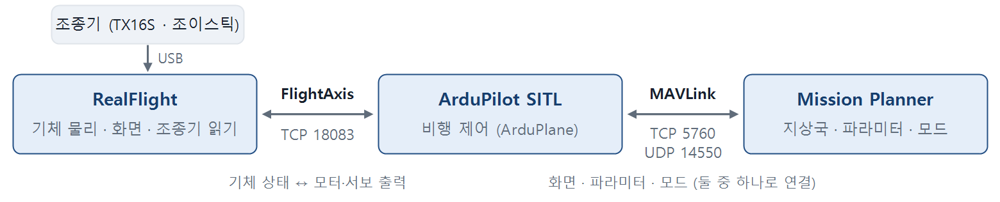
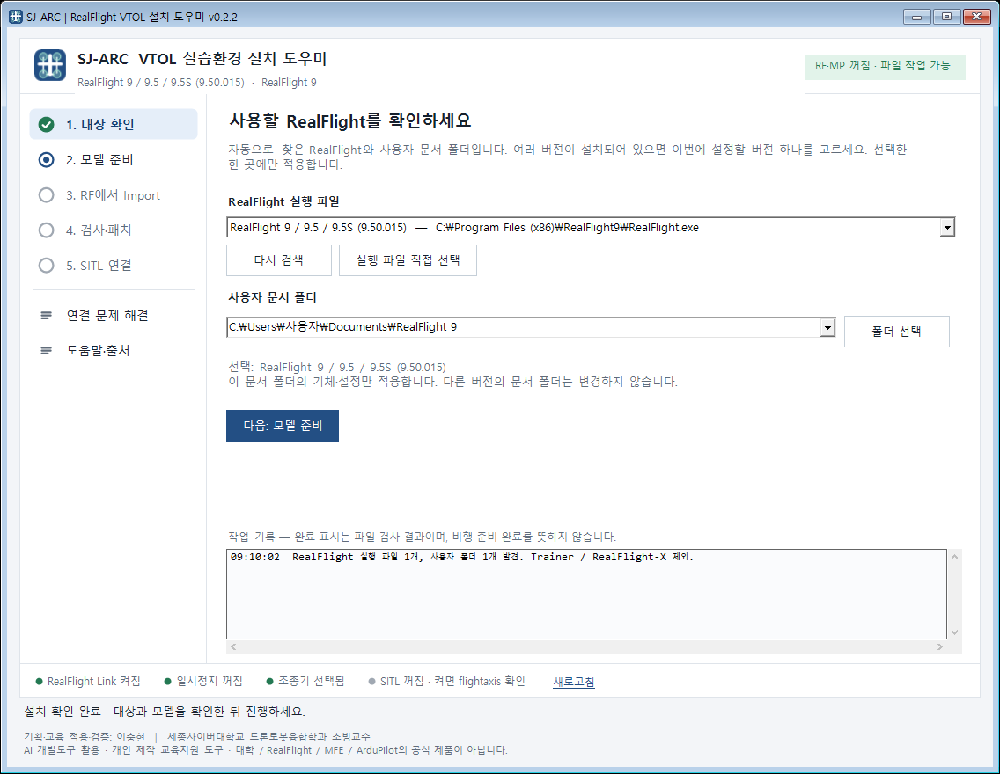
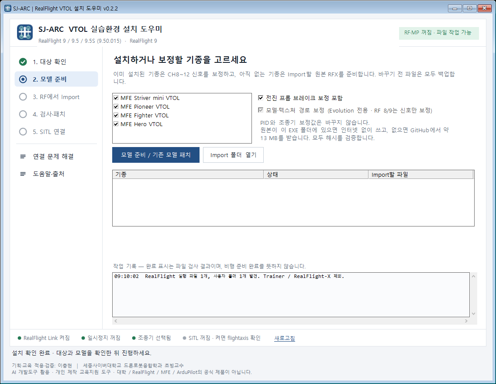
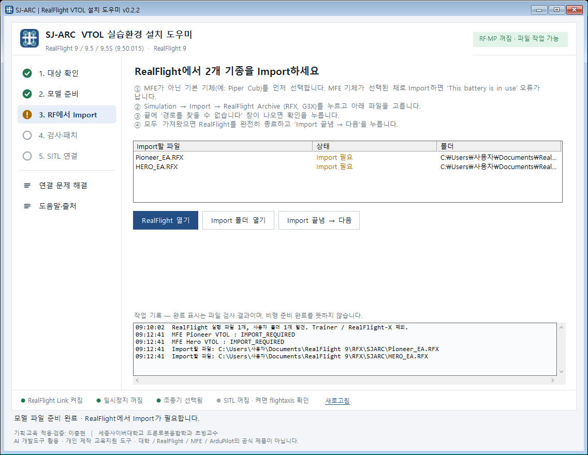
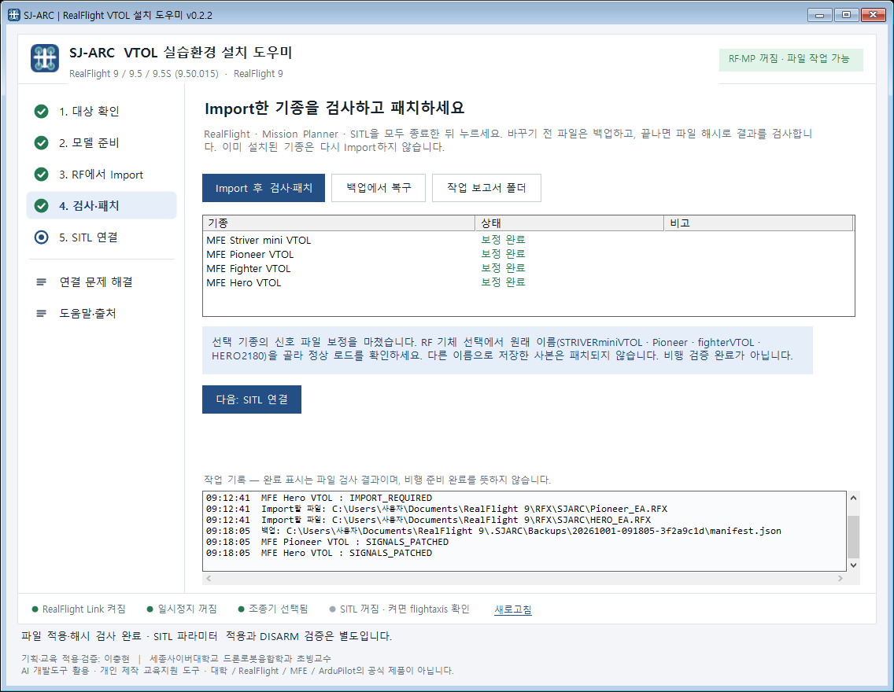
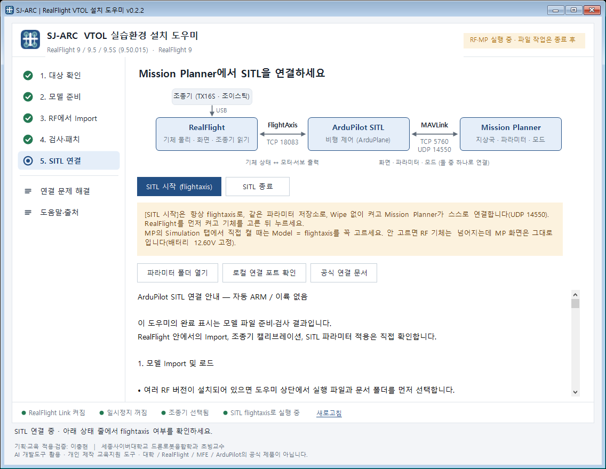
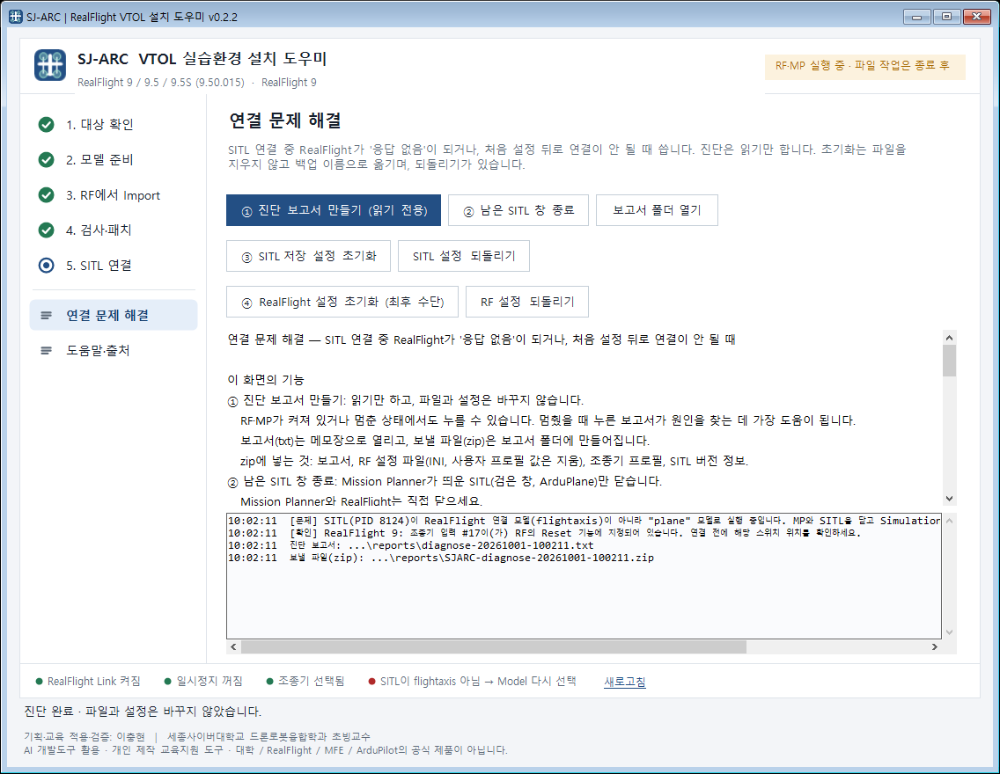

# SJ-ARC RealFlight 설치 도우미

MFE VTOL 4종(Striver mini, Pioneer, Fighter, Hero)을 RealFlight 8 / 9.5 / Evolution에 넣고,
Mission Planner의 ArduPilot SITL(FlightAxis)과 연결해 모의비행할 수 있게 해 주는 Windows 프로그램입니다.
드론 교육 현장에서 RealFlight + Mission Planner 실습 PC를 빠르게 맞추려고 만들었습니다.



- **내려받기:** [Releases](../../releases)의 `SJARC-RealFlight-Setup-v*.zip`
- **인쇄용 가이드:** [사용 가이드 PDF](docs/guide/SJARC-사용가이드-v0.2.2.pdf) (아래 순서와 같은 내용, 11쪽)

## 하는 일과 하지 않는 일

| 도우미가 하는 일 | 도우미가 하지 않는 일 |
|---|---|
| MFE 원본 모델 파일을 받아 SHA-256으로 확인 | 자동 ARM · 이륙 · 비행 명령 |
| RF 기체 파일의 리프트 모터 신호(CH8~12) 보정 | 조종기 보정, 드라이버 설치 |
| RF 설정: RealFlight Link 켜기, 일시정지 끄기, 자동 리셋 2초 | SITL 파라미터 자동 적용 (Mission Planner에서 직접) |
| 바꾸기 전 파일 백업과 되돌리기 | PID · 공력 · 조종기 프로필 변경 |
| [SITL 시작] 버튼, 연결 문제 진단과 되돌릴 수 있는 초기화 | |

시뮬레이터 전용입니다. 이 프로그램의 파라미터 파일을 실제 기체에 넣지 마세요.

## 설치 순서

### 0. 준비

- Windows 10/11, 정품 RealFlight 8 / 9.5 / Evolution, Mission Planner, 조종기(USB 조이스틱 모드, 예: TX16S)가 필요합니다.
- RealFlight를 한 번 실행했다가 완전히 종료합니다. 문서 폴더가 이때 만들어집니다.
- RealFlight · Mission Planner · SITL(검은 창)을 모두 끄고, 실제 비행 컨트롤러는 분리합니다.
- 조종기를 USB로 연결하고 RealFlight에서 선택·보정해 둡니다.
- [Releases](../../releases)에서 zip을 받아 풀고 `SJARC-RealFlight-Setup.exe`를 실행합니다.
  "Windows의 PC 보호" 창이 나오면 **추가 정보 → 실행**을 누릅니다. 코드 서명이 없는 프로그램이라 나오는 경고입니다.

### 1. 대상 확인



- 왼쪽 단계 목록을 위에서부터 따라갑니다. 아래 상태 줄은 RealFlight Link · 일시정지 · 조종기 · SITL 상태를 늘 보여 줍니다.
- 사용할 RealFlight 실행 파일과 문서 폴더(예: `문서\RealFlight 9`)를 확인합니다. 목록이 비어 있으면 **실행 파일 직접 선택**으로 고릅니다.
- RealFlight가 여러 버전 설치된 PC에서는 이번에 설정할 버전 하나만 고릅니다. RF 9와 Evolution을 동시에 켜지 마세요(둘 다 포트 18083을 씁니다).

### 2. 모델 준비



- 설정할 기종을 체크하고(보통 4종 모두), 옵션은 그대로 둔 채 **모델 준비 / 기존 모델 패치**를 누릅니다.
- 원본 모델은 GitHub에서 약 13 MB를 받습니다. 인터넷이 없는 PC에서는 EXE 폴더에 원본 8개(RFX 4개, param 4개)를 두면 그 파일을 씁니다.
- 이미 RF에 있는 기종은 바로 **보정 완료**가 되고, 없는 기종은 **Import 필요**로 3단계로 넘어갑니다.
- 바꾸기 전 파일은 모두 `문서\RealFlight 9\.SJARC\Backups`에 백업됩니다.

### 3. RealFlight에서 Import



Import가 필요한 기종마다 반복합니다.

1. **RealFlight 열기**로 RF를 엽니다.
2. MFE가 아닌 기본 기체(예: Piper Cub)를 먼저 고릅니다. MFE 기체가 선택된 채 Import하면 "This battery is in use" 오류가 납니다.
3. **Simulation → Import → RealFlight Archive (RFX, G3X)** 에서 목록의 파일을 고릅니다(`문서\RealFlight 9\RFX\SJARC`).
   Evolution은 **My RealFlight → Import → RealFlight Archives**입니다.
4. 끝에 "경로를 찾을 수 없습니다" 창이 나오면 확인을 누릅니다. 원본 모델 속 제작자 PC 경로 때문이며 문제없습니다.
5. 모두 가져왔으면 RealFlight를 완전히 종료하고 도우미에서 **Import 끝냄 → 다음**을 누릅니다.

### 4. 검사·패치



- RF · Mission Planner · SITL이 모두 꺼진 상태에서 **Import 후 검사·패치**를 누릅니다. 모든 기종이 **보정 완료**면 성공입니다.
- RF를 열어 원래 이름의 기체(STRIVERminiVTOL · Pioneer · fighterVTOL · HERO2180)를 고르고 FLY가 오류 없이 되는지 봅니다.
- RF 설정은 도우미가 적용해 둡니다. 화면에서 확인만 하세요.

| RF 9: Simulation → Settings → Physics | 값 |
|---|---|
| RealFlight Link | Yes |
| Pause Sim When in Background | No |
| Pause Sim When in Menu | No |
| Automatic Reset Delay | 2.0 |

### 5. SITL 연결



1. RealFlight를 켜고 기체를 고릅니다.
2. 도우미 5단계에서 **SITL 시작 (flightaxis)** 을 누릅니다. 항상 flightaxis로, 같은 파라미터 저장소로, Wipe 없이 켭니다.
3. Mission Planner가 꺼져 있으면 도우미가 켜고, MP가 UDP 14550으로 스스로 연결합니다. 오른쪽 위 단추가 DISCONNECT로 바뀌면 연결된 것입니다.
4. RF에서 스페이스바(리셋)를 눌러 "FlightAxis Controller Device has been activated"가 나오는지 봅니다.
5. 끌 때는 **SITL 종료**를 누르고, RealFlight는 마지막에 끕니다.

Mission Planner의 Simulation 탭에서 직접 켤 때는 **Model = flightaxis**를 꼭 고르고 Wipe는 체크하지 마세요.
flightaxis가 아니면 RF 기체는 넘어지는데 MP 화면은 그대로이고(배터리 12.60V 고정), 비행모드가 MANUAL · FBWA만 보입니다.

### 6. SITL 파라미터 적용

**처음에는 같은 파일을 두 번 불러옵니다.** 새 SITL은 VTOL 기능(Q_ENABLE)이 꺼져 있어서 Q_로 시작하는 파라미터(Q_ASSIST_SPEED 등)가 아직 없습니다.
첫 번째에 Q_ENABLE = 1이 들어가고, SITL을 다시 시작해야 Q_ 파라미터가 생깁니다. 한 번만 불러오면 VTOL 파라미터가 기본값으로 남아 "Q_ASSIST_SPEED is not set"으로 Arm이 거부됩니다.

1. DISARM 상태의 SITL에 연결된 것을 확인합니다.
2. **CONFIG → Full Parameter List → Load from file**로 기종 파일을 고르고 **Write Params**를 누릅니다.
3. SITL을 다시 시작합니다(도우미 **SITL 종료 → SITL 시작**). MP가 다시 연결되면 **Refresh Params**를 누릅니다.
4. 같은 파일로 **Load from file → Write Params**를 한 번 더 하고 SITL을 다시 시작합니다.
5. Full Parameter List에서 Q_ASSIST_SPEED가 14(Fighter는 12)인지 확인합니다.

파일은 `문서\RealFlight 9\.SJARC\Parameters`에 있습니다(5단계의 **파라미터 폴더 열기**).

| 기종 | 불러올 파일 (순서대로) |
|---|---|
| Pioneer | `Pioneer_VTOL_RF_SITL.param` |
| Striver mini | `Striver_VTOL_RF_SITL.param` |
| Fighter | ① `Fighter_VTOL_V4.4.4.param` (위 순서로 두 번) ② `MFE_MotorMap_ONLY.param` (마지막에 한 번) |
| Hero | ① `Hero_VTOL_V4.4.4.param` (위 순서로 두 번) ② `MFE_MotorMap_ONLY.param` (마지막에 한 번) |

Pioneer · Striver의 `*_RF_SITL.param`은 도우미가 받아 온 제조사 원본에 RealFlight용 변경(모터 3·4 번호 등)만 더해 만든 파일입니다.
바뀐 항목은 파일 맨 위에 적혀 있습니다.

- FLTMODE_CH는 조종기의 모드 스위치 채널로 맞춥니다(기본 8).
- 기종을 바꿀 때마다 그 기종의 파일을 다시 불러옵니다.
- 모터 번호: SERVO9 = 33, SERVO10 = 34, SERVO11 = 36, SERVO12 = 35. 제조사 원본은 11·12번이 반대라 그대로 뜨면 한쪽으로 뒤집힙니다.

### 7. 첫 확인 (DISARM부터)

- DISARM 상태에서 모드 스위치가 바뀌는지, MANUAL에서 조종면 방향이 맞는지 봅니다.
- QLOITER(또는 QHOVER) → Arm → 스로틀을 살짝 올려 RF에서 모터 4개가 같이 도는지 봅니다. 뒤집히면 바로 Disarm하고 SERVO11·12를 확인합니다.
- "Q_ASSIST_SPEED is not set"으로 Arm이 거부되면 파라미터를 한 번만 불러온 것입니다. 6단계의 두 번째 불러오기를 합니다.

## 상태 줄

<br>


| 항목 | 초록 (정상) | 빨강·주황일 때 할 일 |
|---|---|---|
| RealFlight Link | 켜짐 | RF Physics에서 RealFlight Link = Yes, 또는 4단계 다시 실행 |
| 일시정지 | 꺼짐 | 두 Pause 항목을 No로 (켜져 있으면 MP를 클릭할 때 RF가 멈춤) |
| 조종기 | 선택됨 | RF에서 조종기를 선택·보정 |
| SITL | flightaxis로 실행 중 | MP·SITL을 닫고 [SITL 시작]으로 다시 켜기 |

## 연결 문제 해결



SITL 연결 중 RealFlight가 "응답 없음"이 되거나, 처음 설정한 뒤로 연결이 안 될 때 위에서부터 하나씩 합니다.

1. RF가 멈춘 상태에서 **① 진단 보고서 만들기**를 누르고, SITL 검은 창을 사진으로 찍어 둡니다. 진단은 읽기만 합니다.
2. RF와 MP를 닫고 **② 남은 SITL 창 종료**를 누른 뒤 다시 연결합니다.
3. 계속 멈추면 **③ SITL 저장 설정 초기화**를 누르고, 파라미터를 넣기 전에 연결부터 확인합니다.
4. 그래도 멈추면 **④ RealFlight 설정 초기화**(최후 수단)를 누르고 조종기와 Physics 설정을 다시 합니다.
5. 해결되지 않으면 되돌리기 버튼으로 원래대로 돌리고 [Issues](../../issues)에 증상을 남겨 주세요.
   진단 zip에는 PC 정보가 들어 있으니 공개 Issue에는 올리지 마세요.

초기화는 파일을 지우지 않고 백업 이름으로 옮기므로 언제든 되돌릴 수 있습니다.

## 자주 나오는 문제

| 증상 | 원인 | 해결 |
|---|---|---|
| RF 기체는 넘어지는데 MP 화면은 그대로, 배터리 12.60V | Model을 flightaxis로 고르지 않음 | [SITL 시작]으로 다시 켜기 |
| 껐다 켜니 비행모드가 MANUAL · FBWA만 보임 | 다른 Model로 켜져 다른 파라미터 저장소를 씀 | flightaxis로 다시 켜기 |
| SITL 연결 전 RF 기체가 계속 뒤집히고 리셋됨 | 연결 전에는 조종기 채널 값으로 모터가 돎 | SITL을 연결하면 멈춤(정상) |
| Import 중 "This battery is in use" | MFE 기체가 선택된 채 Import | 기본 기체를 고른 뒤 Import |
| 뜨자마자 한쪽으로 뒤집힘 | 모터 3·4 번호 반대 | SERVO11 = 36, SERVO12 = 35 확인 |
| "Q_ASSIST_SPEED is not set"으로 Arm 거부 | 파라미터를 한 번만 불러옴 (Q_ 파라미터는 Q_ENABLE이 적용된 뒤에 생김) | SITL 재시작 → Refresh Params → 같은 파일 Load → Write 한 번 더 |

## 모델 파일

MFE 모델 파일(RFX)과 기본 파라미터는 이 저장소에 없습니다. MakeFlyEasy가
[ArduPilot/SITL_Models PR #158](https://github.com/ArduPilot/SITL_Models/pull/158)에 올린 원본을
프로그램이 실행될 때 고정된 커밋(`e93e185`)에서 받아 SHA-256으로 확인합니다.

## 빌드

Python 3과 Windows에 들어 있는 .NET Framework 4 `csc.exe`를 씁니다.

```
python scripts/build_sjarc_setup.py
python scripts/test_sjarc_setup.py
python scripts/build_sjarc_setup.py
```

첫 빌드는 MFE 원본을 `artifacts/`에 받고 실행 파일을 만든 뒤, 테스트 결과가 없어서 멈춥니다.
테스트를 돌린 다음 다시 빌드하면 `dist/`에 배포용 zip이 생깁니다.
현장 키트용 RealFlight SITL 파라미터는 `powershell -File scripts/make-sitl-params.ps1`로 원본에서 만듭니다.

## 버전

버전마다 태그(`v0.2.1` 등)를 달고 [Releases](../../releases)에 EXE zip을 올립니다. 바뀐 내용은 각 Release 설명에 적습니다.

## 라이선스

이 저장소의 코드와 문서는 [MIT 라이선스](LICENSE)입니다. MFE 모델과 파라미터 원본의 권리는 MakeFlyEasy에 있으며
이 라이선스에 포함되지 않습니다. RealFlight 사용은 각자의 RealFlight 라이선스를 따릅니다.
RealFlight, MFE(MakeFlyEasy), ArduPilot, Mission Planner는 각 소유자의 상표이며, 이 프로젝트는 그들과 관계없는 개인 프로젝트입니다.

기획·교육 적용·검증: 이충현 (세종사이버대학교 드론로봇융합학과 초빙교수)
